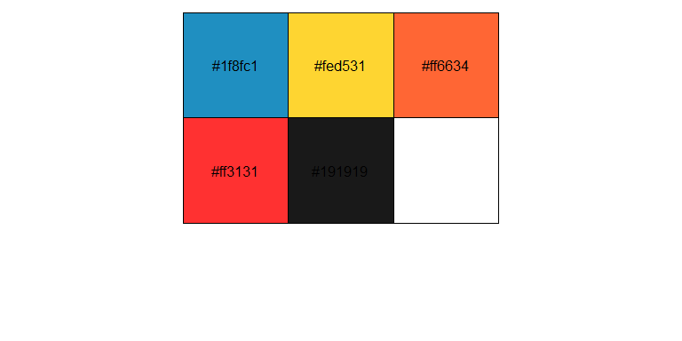
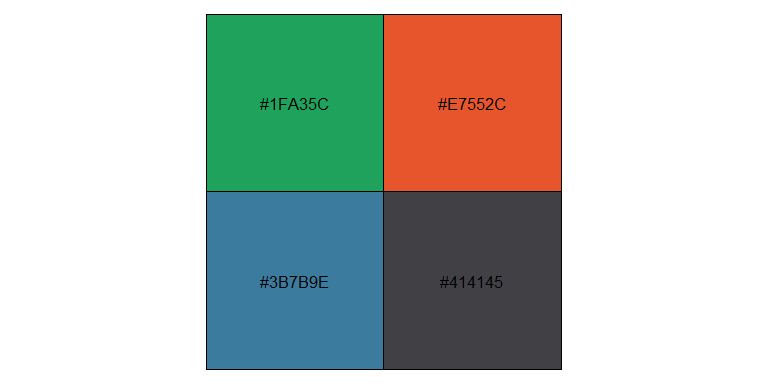

<!-- README.md is generated from README.Rmd. Please edit that file -->

# colors

`colors.yaml` is a file where I put some colors I like.

``` r
set <- yaml::read_yaml("colors.yaml")

purrr::walk(set, function(x) {
  dput(x)
  scales::show_col(x)  
})
#> c("#1f8fc1", "#fed531", "#ff6634", "#ff3131", "#191919")
```

<!-- -->

    #> "#B6297B"

<!-- -->
