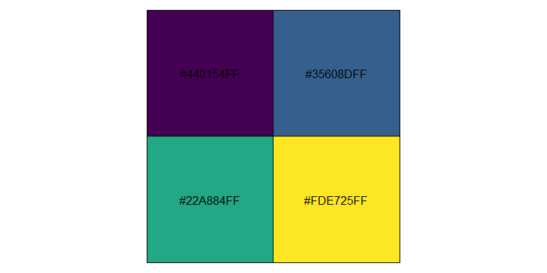
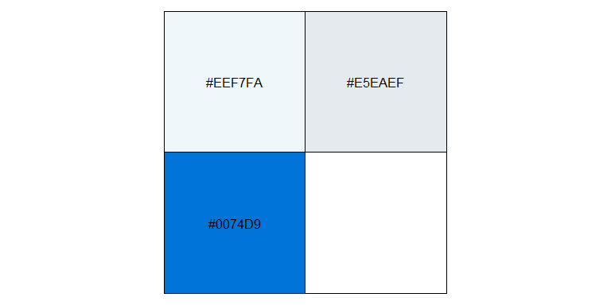
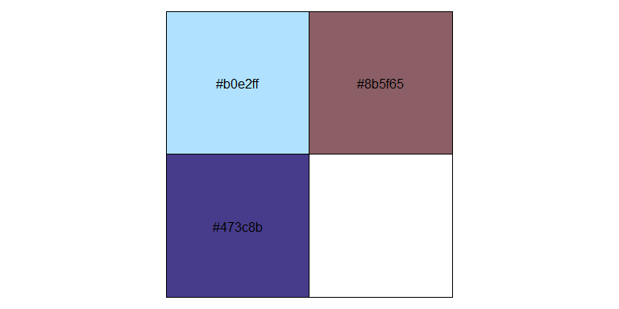

<!-- README.md is generated from README.Rmd. Please edit that file -->

# colors

`colors.yaml` is a file where I put some colors I like.

``` r
set <- yaml::read_yaml("colors.yaml")

purrr::walk(set, function(x) {
  dput(x)
  scales::show_col(x)  
})
#> c("#1f8fc1", "#fed531", "#ff6634", "#ff3131", "#191919")
```

<!-- -->

    #> c("#1FA35C", "#E7552C", "#3B7B9E", "#414145")

<!-- -->

    #> c("#4A5C50", "#ABAE83", "#CEA9C8", "#D4D3D1", "#F0F0F0", "#FAFAFA"
    #> )

<!-- -->

    #> c("#440154FF", "#35608DFF", "#22A884FF", "#FDE725FF")

<!-- -->

    #> c("#6b7a8f", "#f7882f", "#008b8b", "#111111")

<!-- -->

    #> c("#EEF7FA", "#E5EAEF", "#0074D9")

<!-- -->

    #> c("#009DA1", "#BB655F")

<!-- -->

    #> c("#b0e2ff", "#8b5f65", "#473c8b")

<!-- -->

    #> "#B6297B"

<!-- -->
